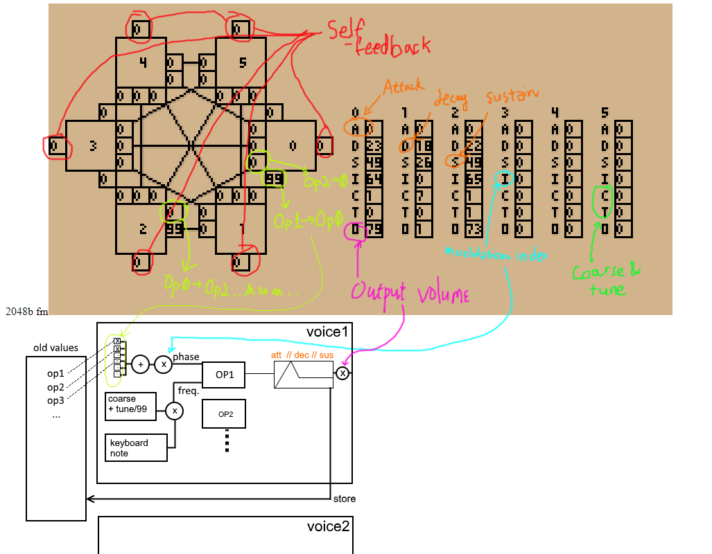

2048b FM
=====

# What is this?
This is a FM (PM) synthesizer that runs in your web browser. Its file size is 2048bytes.

# Features

* 6 Operators
* ADS (Attack, Decay, Sustain) Envelope
* Theoretical 32-voice polyphony (on my computer, no keyboard events fired after holding down 6 keys)
* Arbitrary operator routing. Any operators can route to any other operators, even self. They can be carriers and/or modulators. 
* Saving and loading patches
* C4-A5 keyboard (corresponding to 2 top rows on your keyboard, Q to backslash).

# Components

* Bitmap font 0-9ADSICTO at 160 bytes + 59 bytes (for pixel drawing)
* Bresenham line drawing at 159 bytes + 59 bytes (for pixel drawing)
* DSP + keyboard mapping is at 668 bytes
* The rest: GUI, mouse, patch save/load 754 bytes

# Caveats
* It is not possible for modulators (that does not go directly to output) to be silent. I did this so that we can skip calculations if an operator have zero volume.
* No release envelope stage :c
* No fixed frequency mode. 
* It is not a DX7 emulator :c I first wanted it to be one.

# Diagram of parameters

This part assumes you know synthesis concepts. Here's a diagram:

# Example Patches

* [Glass Keys](https://pending/#0,99,0,0,0,0,0,23,49,64,1,0,79,0,0,0,0,0,0,0,18,26,0,7,0,1,0,99,0,0,0,0,0,22,49,65,1,1,73,0,0,0,0,0,0,0,0,0,0,0,0,0,0,0,0,0,0,0,0,0,0,0,0,0,0,0,0,0,0,0,0,0,0,0,0,0,0,0)
* [Saw Bass](https://pending/#95,0,0,0,0,0,0,22,24,49,0,12,99,0,0,0,0,0,0,0,0,0,0,0,0,0,0,0,0,0,0,0,0,0,0,0,0,0,0,0,0,0,0,0,0,0,0,0,0,0,0,0,0,0,0,0,0,0,0,0,0,0,0,0,0,0,0,0,0,0,0,0,0,0,0,0,0,0)
* [Chord Brass-like Synth](https://pending/#60,0,0,0,0,0,2,12,57,43,0,49,81,0,68,0,0,0,0,2,12,54,58,1,0,74,0,0,65,0,0,0,5,21,47,58,0,62,79,0,0,0,82,0,0,4,27,48,31,1,25,71,0,0,0,0,0,0,0,0,0,0,0,0,0,0,0,0,0,0,0,0,0,0,0,0,0,0)
* [Organ](https://pending/#0,0,0,0,0,0,0,14,63,0,1,0,66,0,0,0,0,0,0,0,26,71,0,1,1,74,0,0,0,0,0,99,0,0,26,99,6,0,29,0,0,0,0,0,0,0,0,21,0,4,1,34,0,0,0,0,0,0,0,0,0,0,0,0,0,0,0,0,0,0,0,0,0,99,0,0,3,3)

# Acknowledgments

* Thanks [Werner](http://bpmdj.yellowcouch.org/) for showing me more efficient way of PM/FM synthesis
* [p01](https://github.com/p01) p01 for such awesome 1k demos that got me into this.

# License

Public Domain.

